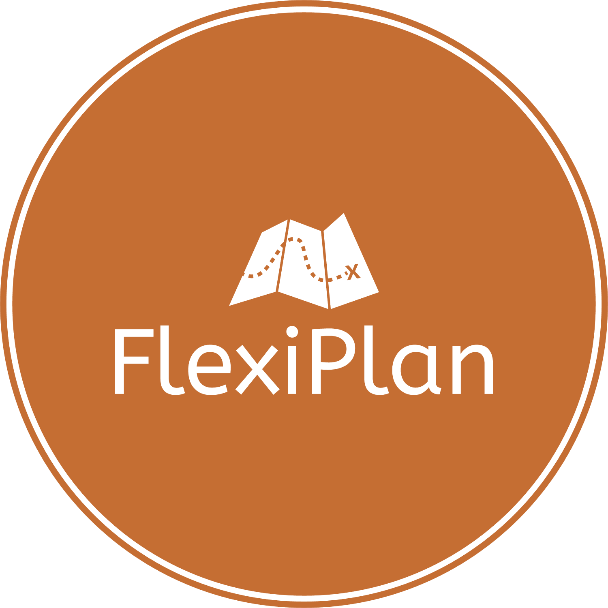
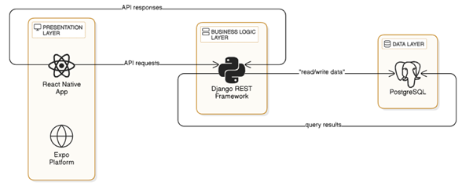

# **FlexiPlan**

  

### *An AI-Powered Routine Balancer*

FlexiPlan is a mobile application designed to help users effectively manage their daily schedules by balancing work tasks and personal hobbies. Using **AI**, the app generates **personalized daily and weekly routines**, adapts to the user's energy levels and mood, and encourages a healthy work-life balance. FlexiPlan also includes social features like routine sharing, hobby exploration, and in-app messaging. The project also utilizes a **LangChain AI agent** for enhanced functionality.

---

## **Features**
- 🧠 **AI-powered routine generation** based on user preferences.
- 🔄 **Weekly routine adjustments** with prioritized hobbies.
- 🌟 **Mood and energy tracking** for adaptive schedules.
- 🎨 **Explore hobbies** and add them to routines.
- 🤝 **Social features**: add friends, share routines, and chat.
- 🔔 **Notifications and reminders** for tasks and activities.

---

## **Tech Stack**
- **Frontend**: React Native (TypeScript)
- **Backend**: Django (Django Rest Framework)
- **Database**: PostgreSQL
- **AI Integration**: LangChain AI agent

---

## Architecture

---

## **How to Run**
- Clone the repository and follow the setup instructions in the [README.md](./README.md) file.
- Ensure the backend runs on `localhost:8000` and the frontend on `localhost:3000`.

---

📌 *Feel free to contribute or share your feedback!*
